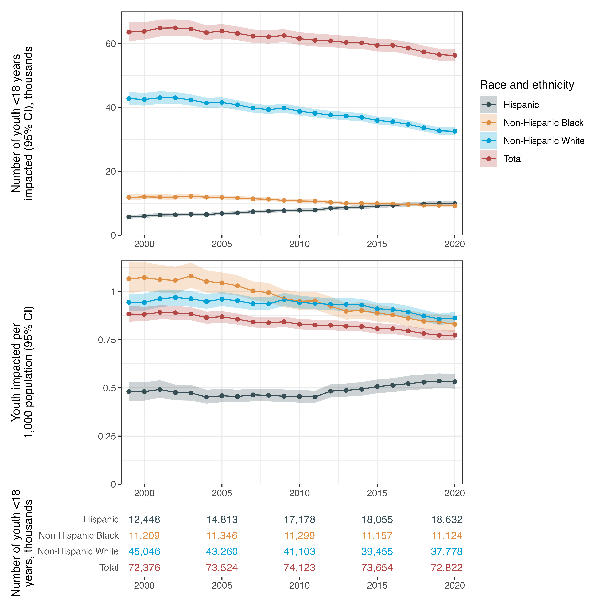

<!-- README.md is generated from README.Rmd. Please edit that file -->

## Youths experiencing parental death due to cancer

This repository,
[`parental_deaths_cancer`](https://github.com/mkiang/parental_deaths_cancer),
contains reproducible code for our *JAMA Network Open* research letter,
“Youths experiencing parental death due to cancer”, which uses
publicly-available multiple causes of death data from January 1, 1990,
through December 31, 2020, from the [National Center for Health
Statistics](https://wonder.cdc.gov/) to quantify the number of children
experiencing parental death due to cancer. The full citation is:

> Potter AL, Schlüter B-S, Alexander MJ, Yang C-FJ, Kiang MV, “Youths
> experiencing parental death due to cancer”. *JAMA Network Open*.
> Published online July 7, 2025. doi: 10.1001/jamanetworkopen.2025.19106

## About this repository

Most of the code in this repository is based on [code from our original
*JAMA* paper](https://github.com/benjisamschlu/parental_deaths). All
code can be found in the `./code` folder and must be run in order. The
first few lines of each code file contains a brief description of the
tasks related to that file. Numeric representation of our figures can be
found in the `./output` folder. Figures are in the `./figures` folder.

## Authors (alphabetical)

- [Monica J Alexander](https://www.monicaalexander.com/)
- [Mathew V Kiang](https://mathewkiang.com)
- [Alexandra L
  Potter](https://www.linkedin.com/in/alexandra-potter-63b5681aa/)
- [Benjamin-Samuel Schlüter](https://www.benjaminschluter.com/)
- [Jeffrey Yang](https://yang-lab.mgh.harvard.edu)

## Notes on Reproducibility

We use publicly available data and provide code that will download
and/or munge these data as necessary.

For full reproducibility, we also provide all of our simulation files as
well as our original and processed data, which will allow for exact
reproduction of our results. Due to file size limitations on Github, the
files are stored on [the Stanford Digital
Repository](https://purl.stanford.edu/xf360tg2895).

To use these files, download each folder noting that the `simulations`
folder (~117GB) should be a subfolder of `./output` while the
`data_processed` (~1.2GB) and `data_raw` (~3GB) folders should be in the
project root (`./`).

We use [`renv`](https://rstudio.github.io/renv/index.html) for package
management but below we also post the relevant session information to
ensure full reproducibility.
